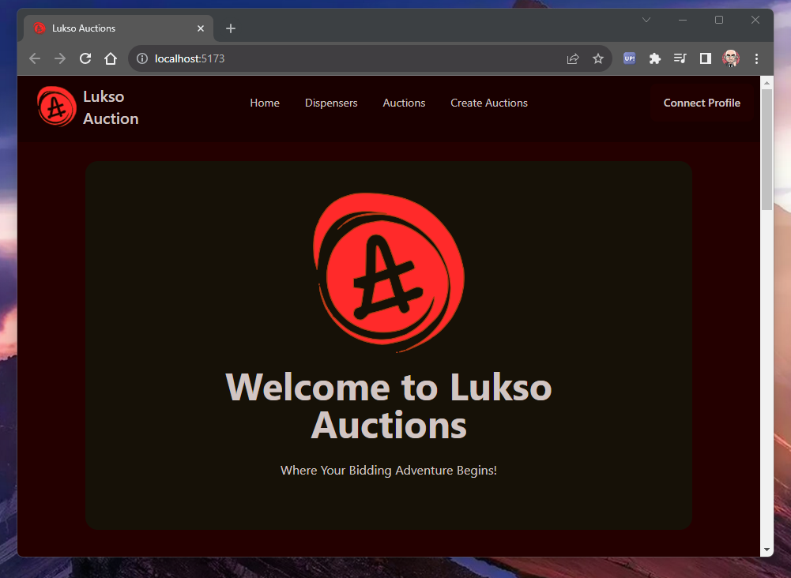
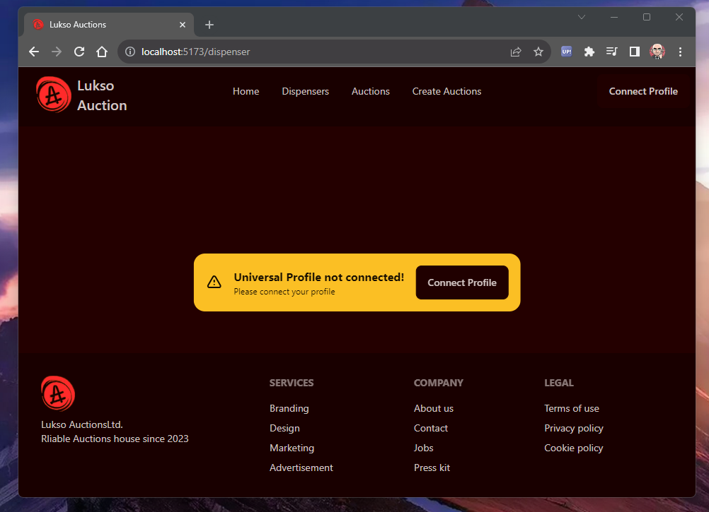
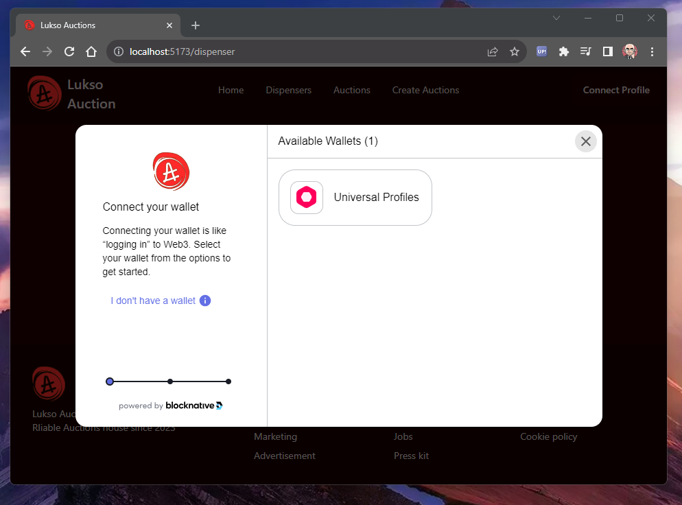
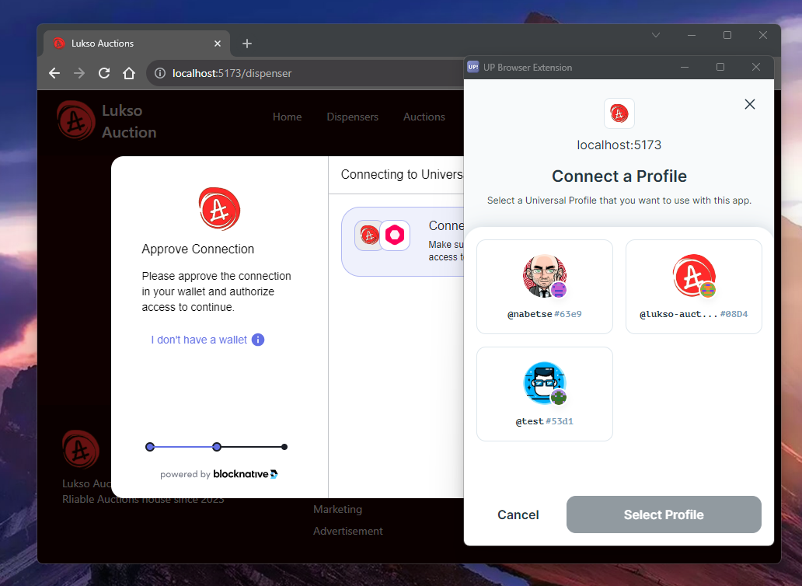
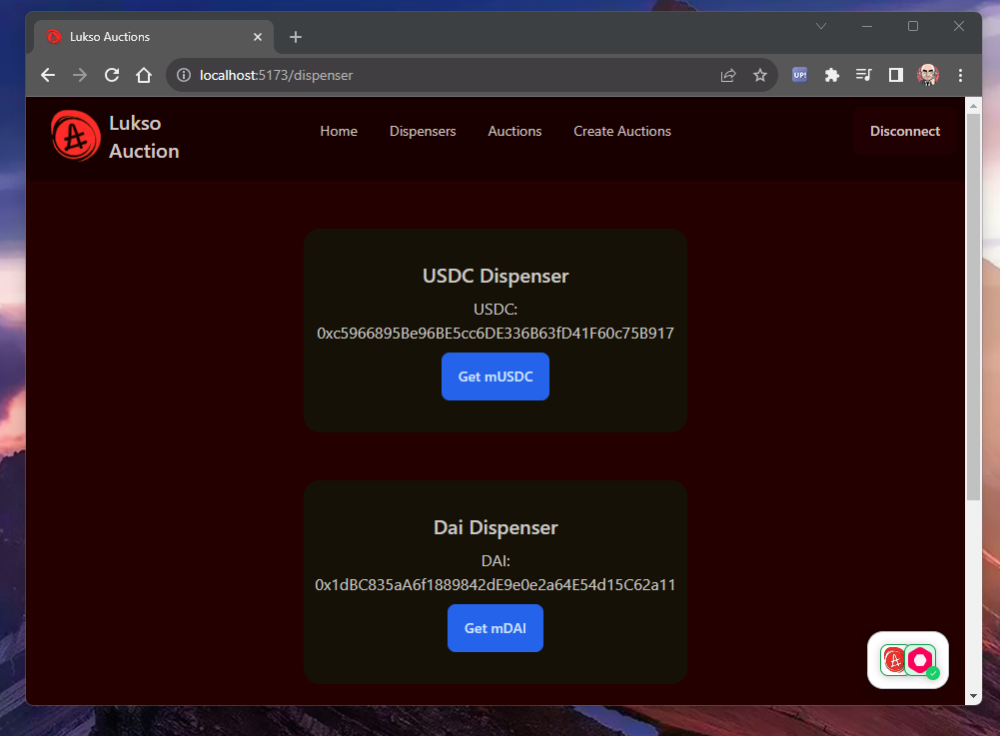
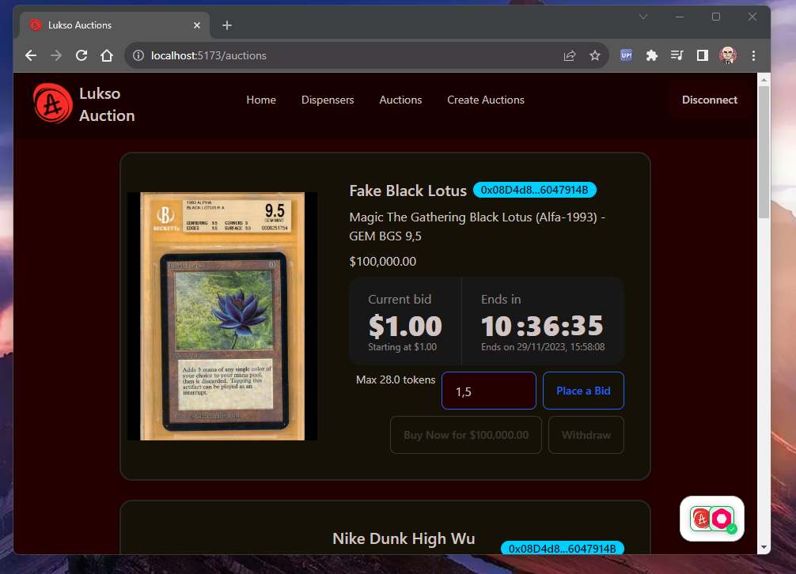
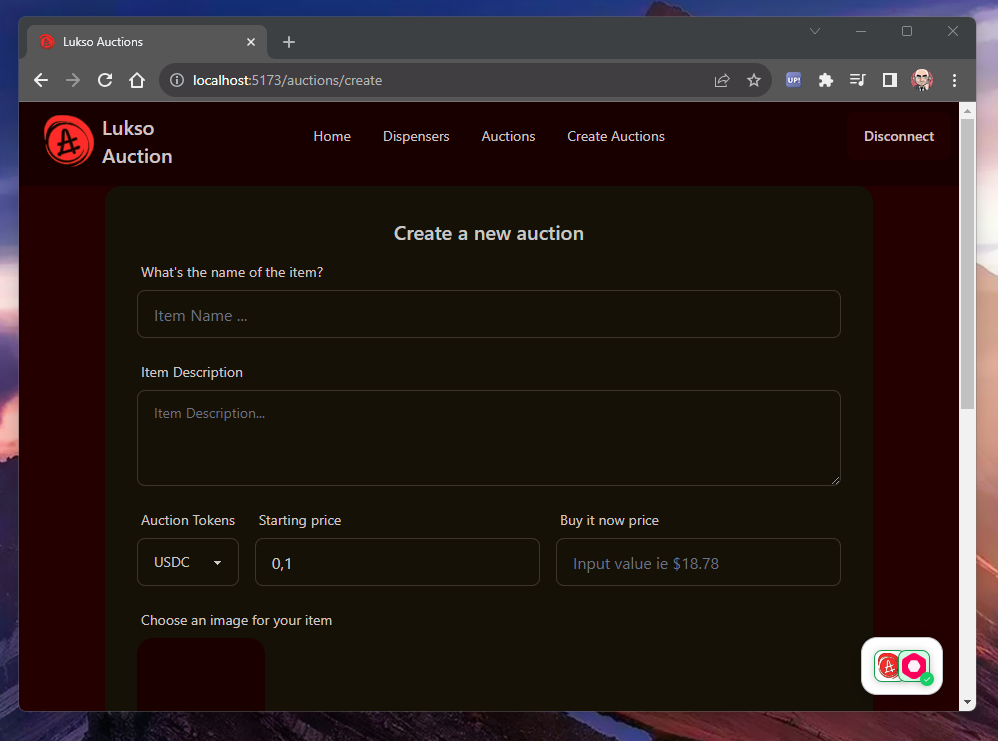

# Front end

Copy [./.env.template](./.env.template) and fill it with your data.

You wil need a pinata api key and jwt in order to upload files to ipfs. See [https://www.pinata.cloud](https://www.pinata.cloud) for details

Then install
```
> npm i 
```

And run
```
npm run dev
```
Dev server should be at
```
http://localhost:5173/
```

# demo url

[github page here](https://nabetse00.github.io/lukso-app)
Don't forget to deactivate your Adblocker !

# Screenshots


- Main 

- Connect 
- Choose universal profile 
- choose a account 
- dispense some tokens 
- start bidding 
- or create an Auction 

